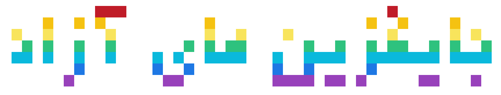

# جایگزین های آزاد

**به ویکی جایگزین‌های نرم‌افزاری آزاد خوش آمدید!**

معرفی مجموعه‌ای از جایگزین‌های آزاد برای نرم‌افزارهای انحصاری.

---

<a href="android/" class="section-card">

🤖

اندروید

برنامه‌ها، بازی‌ها و ابزارهای آزاد اندرویدی

</a>

<a href="front-ends.html" class="section-card">

🌐

پیشانه‌ها

پیشانه‌های آزاد برای یوتیوب، توییتر و بیشتر

</a>

---

## نرم‌افزار آزاد چیست؟

> «نرم‌افزار آزاد» درباره آزادی است، نه قیمت.
برای درک بهتر باید به معنای «آزاد» در «آزادی بیان» فکر کنید، نه در «غذای مجانی».

نرم‌افزار آزاد به کاربران این چهار آزادی را می‌دهد:

**آزادی ۰** — اجرای برنامه برای هر منظوری

**آزادی ۱** — مطالعه و تغییر کد منبع برنامه

**آزادی ۲** — توزیع مجدد کپی‌ها برای کمک به دیگران

**آزادی ۳** — بهبود برنامه و انتشار تغییرات برای عموم

هر نرم‌افزاری که این حقوق کاربر را رعایت نکند آزاد نیست.

[بیشتر بخوانید](https://www.gnu.org/philosophy/free-sw.fa.html)

---
